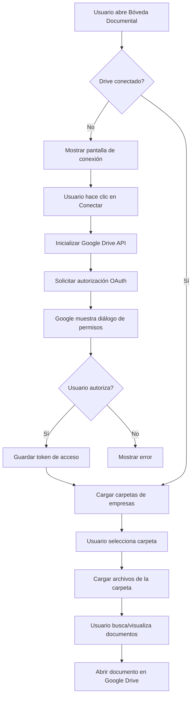

# Integración con Google Drive - SafeTrack Chile

## 📋 Descripción General

Este documento describe la integración de Google Drive con SafeTrack Chile para la **Bóveda Documental**, permitiendo acceso de solo lectura a documentos organizados por empresa.

---

## 🏗️ Arquitectura de la Integración

### Estructura de Carpetas en Google Drive

```
Google Drive Root/
├── Constructora Los Andes/
│   ├── Reglamento Interno.pdf
│   ├── Matriz IPER.xlsx
│   ├── Certificados/
│   └── Capacitaciones/
├── Minera del Norte/
│   ├── Reglamento Interno.pdf
│   ├── Plan de Emergencia.pdf
│   └── Inspecciones/
└── Empresa Logística SA/
    ├── Documentos Legales/
    ├── Procedimientos/
    └── Registros/
```

**Cada carpeta representa una empresa** y contiene todos sus documentos relevantes.

---

## 🔧 Componentes Creados

### 1. **Servicio Principal** (`/src/app/services/googleDrive.ts`)

Servicio completo con todas las funciones necesarias para interactuar con Google Drive API.

#### Funcionalidades principales:

- ✅ Inicialización de Google Drive API
- ✅ Autenticación OAuth 2.0 con solo lectura
- ✅ Listado de carpetas de empresas
- ✅ Listado y búsqueda de archivos
- ✅ Visualización de documentos en Drive
- ✅ Utilidades de formato (tamaño, fecha, iconos)
- ✅ Sincronización con SafeTrack

### 2. **Hook Personalizado** (`/src/app/hooks/useGoogleDrive.ts`)

Hook de React que facilita el uso del servicio de Google Drive en componentes.

#### Estado que gestiona:

```typescript
{
  isInitialized: boolean;    // API inicializada
  isAuthorized: boolean;     // Usuario autorizado
  isLoading: boolean;        // Operación en curso
  error: string | null;      // Mensajes de error
  folders: DriveFolder[];    // Carpetas de empresas
  files: DriveFile[];        // Archivos en carpeta actual
  syncStatus: {              // Estado de sincronización
    isOnline: boolean;
    lastSync: string | null;
    pendingFiles: number;
    syncInProgress: boolean;
  }
}
```

### 3. **Componente de UI** (`/src/app/components/GoogleDriveIntegration.tsx`)

Interfaz completa para gestionar la conexión y navegación de Google Drive.

#### Características:

- 🎨 Diseño coherente con SafeTrack Chile (gris oscuro, naranja #FF8C00, azul #0055A4)
- 📱 Mobile-first y responsive
- 🔐 Flujo de autenticación guiado
- 📂 Navegación de carpetas y archivos
- 🔍 Búsqueda de documentos
- 🔄 Sincronización manual
- 📊 Indicadores de estado (online/offline, última sincronización)

---

## 🚀 Configuración Requerida

### Paso 1: Crear Proyecto en Google Cloud Console

1. Ve a [Google Cloud Console](https://console.cloud.google.com/)
2. Crea un nuevo proyecto: **"SafeTrack Chile - Drive Integration"**
3. Habilita las siguientes APIs:
   - **Google Drive API**
   - **Google Identity Services**

### Paso 2: Configurar OAuth 2.0

1. En el menú lateral, ve a **APIs & Services > Credentials**
2. Haz clic en **+ CREATE CREDENTIALS > OAuth client ID**
3. Selecciona tipo de aplicación: **Web application**
4. Configura:
   - **Name**: SafeTrack Chile Web
   - **Authorized JavaScript origins**:
     - `http://localhost:5173` (desarrollo)
     - `https://tu-dominio-produccion.com`
   - **Authorized redirect URIs**:
     - `http://localhost:5173/oauth2callback`
     - `https://tu-dominio-produccion.com/oauth2callback`

5. Copia el **Client ID** generado

### Paso 3: Crear API Key

1. En **Credentials**, haz clic en **+ CREATE CREDENTIALS > API key**
2. Copia la **API Key** generada
3. (Opcional) Restringe la API Key solo a Google Drive API

### Paso 4: Configurar Scopes

Los scopes ya están configurados en el código:

```typescript
scopes: [
  'https://www.googleapis.com/auth/drive.readonly',
  'https://www.googleapis.com/auth/drive.metadata.readonly'
]
```

Estos permisos garantizan **solo lectura**, sin capacidad de modificar o eliminar archivos.

### Paso 5: Actualizar Credenciales en el Código

Edita `/src/app/services/googleDrive.ts`:

```typescript
const GOOGLE_DRIVE_CONFIG: GoogleDriveConfig = {
  clientId: 'TU_CLIENT_ID.apps.googleusercontent.com', // ← Reemplazar
  apiKey: 'TU_API_KEY',                                 // ← Reemplazar
  scopes: [
    'https://www.googleapis.com/auth/drive.readonly',
    'https://www.googleapis.com/auth/drive.metadata.readonly'
  ]
};
```

---

## 💻 Uso en Código

### Ejemplo 1: Usar el Hook en un Componente

```tsx
import { useGoogleDrive } from '@/app/hooks/useGoogleDrive';

function MyComponent() {
  const {
    isAuthorized,
    folders,
    loadCompanyFolders,
    authorize
  } = useGoogleDrive({ autoInitialize: true });

  const handleConnect = async () => {
    await authorize();
    await loadCompanyFolders();
  };

  return (
    <div>
      {!isAuthorized ? (
        <button onClick={handleConnect}>
          Conectar con Google Drive
        </button>
      ) : (
        <ul>
          {folders.map(folder => (
            <li key={folder.id}>{folder.name}</li>
          ))}
        </ul>
      )}
    </div>
  );
}
```

### Ejemplo 2: Usar el Servicio Directamente

```typescript
import GoogleDriveService from '@/app/services/googleDrive';

// Inicializar
await GoogleDriveService.initialize();

// Autorizar
await GoogleDriveService.authorize();

// Listar carpetas de empresas
const folders = await GoogleDriveService.listCompanyFolders();

// Listar archivos en una carpeta
const { files } = await GoogleDriveService.listFilesInFolder('folder_id_123');

// Buscar archivos
const results = await GoogleDriveService.searchFilesInFolder(
  'folder_id_123',
  'reglamento'
);

// Abrir archivo en Drive
GoogleDriveService.openFileInDrive(file);
```

### Ejemplo 3: Integrar en DocumentVault

```tsx
import { GoogleDriveIntegration } from '@/app/components/GoogleDriveIntegration';

function DocumentVault() {
  const [showDrive, setShowDrive] = useState(false);

  if (showDrive) {
    return (
      <GoogleDriveIntegration
        onBack={() => setShowDrive(false)}
        companyId="empresa-123"
        companyName="Constructora Los Andes"
      />
    );
  }

  return (
    <div>
      <button onClick={() => setShowDrive(true)}>
        Conectar Google Drive
      </button>
    </div>
  );
}
```

---

## 🔐 Seguridad y Permisos

### Modelo de Seguridad

1. **Solo Lectura**: Los scopes configurados (`drive.readonly`) garantizan que la aplicación solo puede **leer** documentos, nunca modificarlos o eliminarlos.

2. **OAuth 2.0**: La autenticación se realiza mediante el flujo OAuth de Google, asegurando que:
   - El usuario autoriza explícitamente el acceso
   - Los tokens tienen tiempo de expiración
   - El usuario puede revocar el acceso en cualquier momento

3. **Acceso por Carpeta**: El prevencionista solo puede acceder a las carpetas que están configuradas en su cuenta de Google Drive.

### Revocar Acceso

El usuario puede revocar el acceso en cualquier momento:

1. Desde SafeTrack: Botón **"Cerrar sesión"** en la interfaz
2. Desde Google: [myaccount.google.com/permissions](https://myaccount.google.com/permissions)

---

## 📊 Flujo de Usuario



---

## 🔄 Sincronización

### Estado de Sincronización

El sistema monitorea automáticamente:

- **Conectividad**: Detecta cuando el dispositivo está online/offline
- **Última sincronización**: Timestamp de la última actualización
- **Archivos pendientes**: Cantidad de archivos que deben sincronizarse
- **Sincronización en progreso**: Indicador de operación en curso

### Sincronización Manual

```typescript
const { syncDocuments } = useGoogleDrive();

// Sincronizar documentos de una empresa
await syncDocuments('empresa-id-123', 'folder-id-456');
```

### Integración con Backend (Futuro)

Cuando se implemente el backend con Supabase:

```typescript
// Ejemplo de integración
export const syncDriveDocuments = async (
  companyId: string,
  folderId: string
): Promise<DriveFile[]> => {
  // 1. Obtener archivos de Google Drive
  const { files } = await listFilesInFolder(folderId);
  
  // 2. Guardar metadatos en Supabase
  await supabase.from('documents').upsert(
    files.map(file => ({
      id: file.id,
      company_id: companyId,
      name: file.name,
      mime_type: file.mimeType,
      size: file.size,
      modified_time: file.modifiedTime,
      web_view_link: file.webViewLink
    }))
  );
  
  // 3. Retornar archivos
  return files;
};
```

---

## 🧪 Testing

### Verificar la Integración

1. **Inicialización**:
   ```typescript
   const { isInitialized } = useGoogleDrive({ autoInitialize: true });
   console.assert(isInitialized, 'API debe inicializarse');
   ```

2. **Autorización**:
   ```typescript
   await authorize();
   console.assert(isAuthorized, 'Usuario debe estar autorizado');
   ```

3. **Listar carpetas**:
   ```typescript
   await loadCompanyFolders();
   console.assert(folders.length > 0, 'Debe haber al menos una carpeta');
   ```

4. **Listar archivos**:
   ```typescript
   await loadFiles(folderId);
   console.assert(files.length >= 0, 'Debe retornar array de archivos');
   ```

### Casos de Prueba

- ✅ Usuario conecta por primera vez
- ✅ Usuario rechaza autorización
- ✅ Usuario cierra sesión y vuelve a conectar
- ✅ No hay carpetas en Drive
- ✅ Carpeta vacía
- ✅ Búsqueda sin resultados
- ✅ Dispositivo pierde conexión durante sincronización
- ✅ Abrir diferentes tipos de archivos (PDF, XLSX, DOC)

---

## 🐛 Troubleshooting

### Error: "Error al cargar Google API"

**Causa**: Scripts de Google no se cargaron correctamente.

**Solución**:
1. Verificar conexión a Internet
2. Verificar que no hay bloqueadores de ads/scripts
3. Comprobar consola del navegador para errores de CORS

### Error: "No autorizado"

**Causa**: El usuario no ha completado el flujo de OAuth.

**Solución**:
1. Llamar a `authorize()` antes de cualquier operación
2. Verificar que el Client ID es correcto
3. Verificar que el dominio está en "Authorized JavaScript origins"

### Error: "Token expirado"

**Causa**: Los tokens de Google tienen tiempo de expiración.

**Solución**:
```typescript
// Implementar refresh automático
if (!isAuthorized()) {
  await authorize();
}
```

### No se muestran carpetas

**Causa**: 
- No hay carpetas en el root de Drive
- Permisos insuficientes

**Solución**:
1. Crear carpetas en el root de Google Drive
2. Verificar que los scopes incluyen `drive.readonly`
3. Comprobar que el usuario autorizó los permisos

---

## 📈 Próximos Pasos (Roadmap)

### Fase 1: Integración Básica ✅
- [x] Servicio de Google Drive
- [x] Hook personalizado
- [x] Componente de UI
- [x] Documentación

### Fase 2: Persistencia (Próximo)
- [ ] Guardar metadatos en Supabase
- [ ] Cache local de documentos
- [ ] Sincronización automática en segundo plano
- [ ] Notificaciones de documentos nuevos/actualizados

### Fase 3: Características Avanzadas
- [ ] Descarga offline de documentos
- [ ] Versionado de documentos
- [ ] Compartir documentos con trabajadores
- [ ] Firma digital de documentos desde Drive
- [ ] Integración con módulo de Capacitaciones

### Fase 4: Optimización
- [ ] Paginación de resultados
- [ ] Caché de thumbnails
- [ ] Precarga de documentos frecuentes
- [ ] Compresión de imágenes

---

## 🔗 Referencias

- [Google Drive API Documentation](https://developers.google.com/drive/api/v3/about-sdk)
- [Google Identity Services](https://developers.google.com/identity/gsi/web)
- [OAuth 2.0 Scopes](https://developers.google.com/identity/protocols/oauth2/scopes#drive)
- [Google Cloud Console](https://console.cloud.google.com/)

---

## 📝 Notas Adicionales

### Limitaciones de la API de Google Drive

- **Cuota de solicitudes**: 1,000 consultas por usuario por 100 segundos
- **Tamaño de respuesta**: Máximo 1,000 archivos por página
- **Tipos de archivo**: No se pueden previsualizar todos los tipos de archivo

### Recomendaciones

1. **Organización de carpetas**: Mantener una estructura clara (una carpeta = una empresa)
2. **Nombrado de archivos**: Usar nombres descriptivos y consistentes
3. **Sincronización**: Ejecutar sincronización durante horarios de baja actividad
4. **Monitoreo**: Trackear uso de cuota de la API

### Costos

- Google Drive API es **gratuita** dentro de los límites de cuota
- No hay cargos adicionales por uso de OAuth 2.0
- El almacenamiento en Google Drive se cobra según el plan del usuario

---

## 👤 Autor

**SafeTrack Chile - Sistema de Gestión de Prevención de Riesgos**

Integración desarrollada para facilitar el acceso seguro a documentos empresariales desde la aplicación móvil.

---

## 📄 Licencia

Este código es parte del sistema SafeTrack Chile y está sujeto a sus términos de uso.

---

**¿Listo para implementar? Sigue los pasos de configuración y comienza a usar Google Drive en SafeTrack Chile.**
